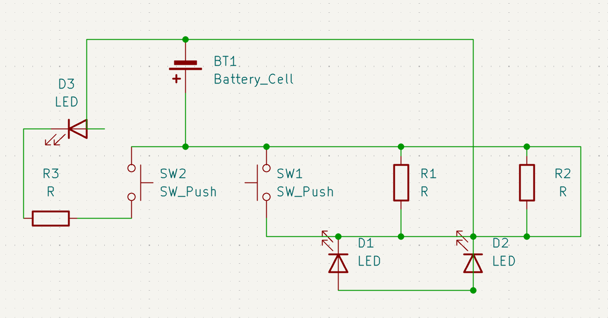
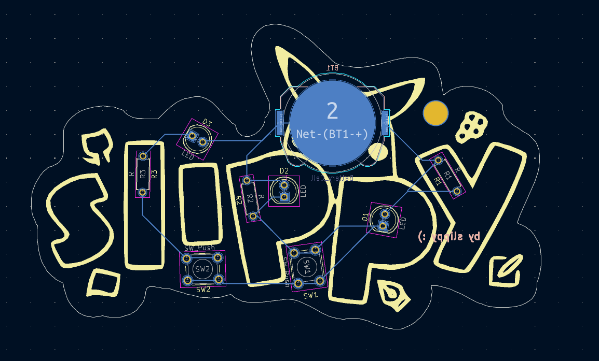
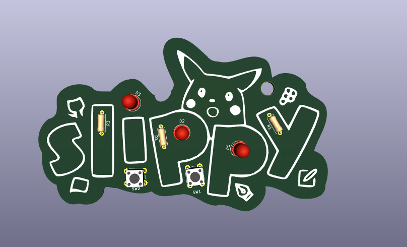
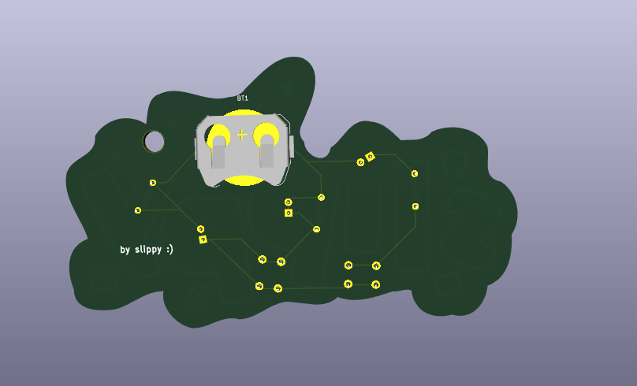

# SlippyPCB

My very first custom PCB design! SlippyPCB is a simple board with 2 buttons and 3 LEDs. One button controls two LEDs, and the other controls just one. Made to explore the basics of schematic design, PCB layout, and fabrication.

---

### Schematic

---

### PCB

---

### 3D View

---

### Features
- Powered by a coin cell battery  
- Two tactile buttons for interactive LED control  
- Custom silkscreen art on the front side  
- My first ever PCB!

---

### BoM
- 1x Coin Cell Battery Holder  
- 2x Push Buttons
- 3x LEDs   
- 3x Resistors  

---

Made by @slippy on Slack

Created as part of http://solder.hackclub.com/
